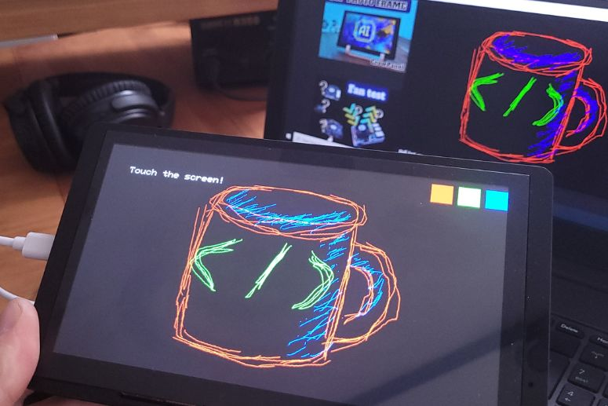

# crowpanel_DrawingBoard

Files for the project of turning CrowPanel Advance 7 into a drawing board.

A detailed description can be found on my blog https://lepczynski.it/en/other/build-your-own-digital-drawing-board-with-crowpanel-advance/.

You can see it in action in the video on YouTube https://www.youtube.com/watch?v=YsSouYrD_dE.

Created based on the elecrow repository https://github.com/Elecrow-RD.
